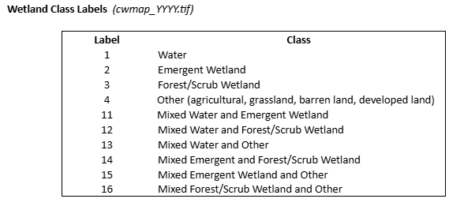
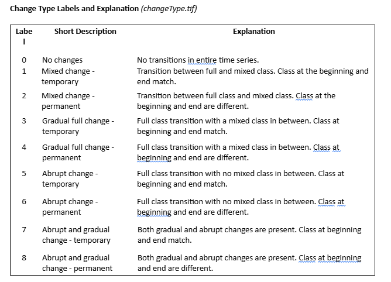
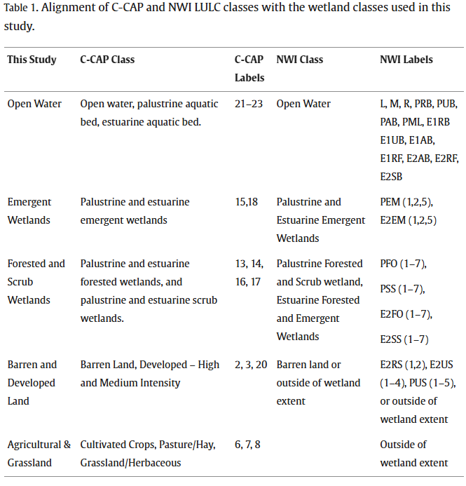

This code is mostly for arcpy (maybe a little bit of matlab). I am not sure if one can use arcpy code without the arcgis pro license. I've been using this in arcgis pro in their python jupyter notebook environment. 

Get Dr. Di Vittorio's cwmap and changetype.tif files here: https://zenodo.org/records/13525004

Get uvvr files here: https://www.sciencebase.gov/catalog/item/668569d6d34e8a8b016cd00d

Get CCAP files here: https://www.sciencebase.gov/catalog/item/668569d6d34e8a8b016cd00d (it seems they have recently added files for 1975, 1985, and 1992)

Class codes for cwmap_{year}.tif:

Change Type Labels and Explanation (changeType.tif):

Compare CCAP and cwmap classes:

